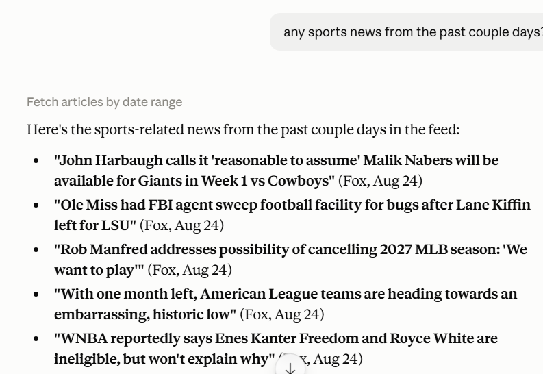
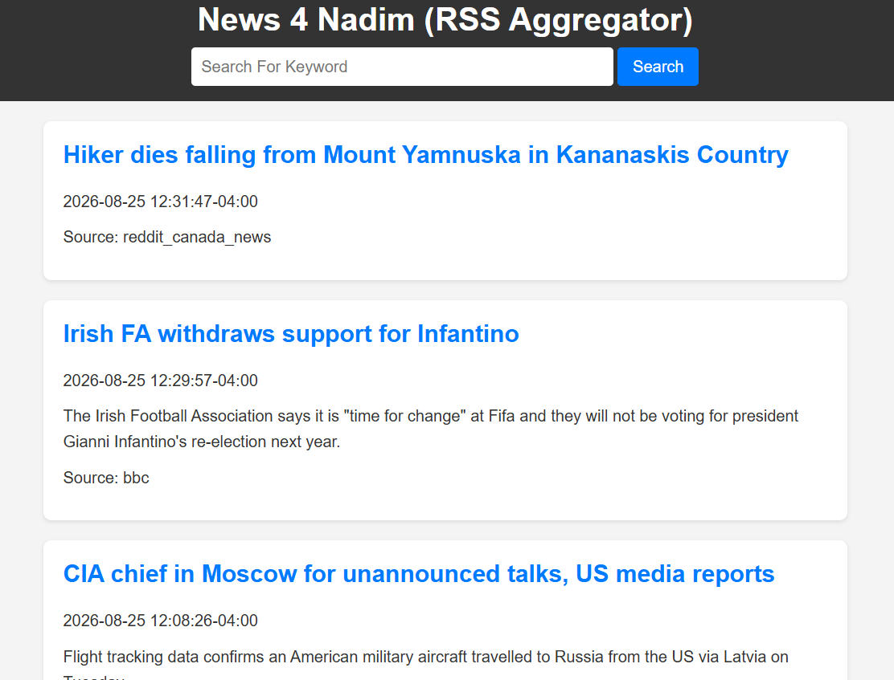

# My RSS Feed
### By Nadim Sherif

To learn more about rss feeds, Ive decideed to make a small local project where I retrieve news from multiple different sources and display them on a simple html site. Sadly I realized that the CNN rss is outdated, so all the news retrieved is from 2023 and before. Luckily the other three work fine!

Additionally, Claude Desktop is hooked up to my server via MCP so queries could be asked directly through that.

### How to Run

Running the app is very simple! all you need to do is: 
python app.py

in the project directory and the app will launch. You can either view it on the html, or directly ask Claude to bring articles youd like to view.

### How to Refresh

The feed auto refreshes everytime the app is run, and also on its own everyday at 10am and 10pm.

To refresh the feed manually you run: 
python refresh.py